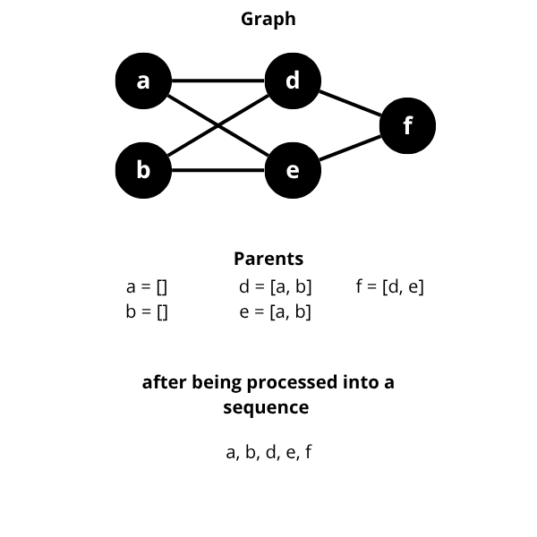

# Tensor
`ROTTA-rs` uses tensors to perform operations. Tensors are structs that have the following properties:

```rust
pub struct Tensor {
    pub node: NodeType,
}
```

As you can see, a tensor only has one property: a `node`, which stores data of type `NodeType`.

`NodeType` is actually just an alias, and the actual data type is:
```rust
pub type NodeType = Arc<Mutex<Node>>;
```

you can see a struct called `node`, and node is the core of the tensor which contains:
```rust
pub struct Node {
    pub id: u128,
    pub value: Arrayy,
    pub grad: Arrayy,
    pub parent: Vec<NodeType>,
    pub label: Option<BackwardLabel>,
    // requires
    pub requires_grad: bool,
    pub auto_zero_grad: bool,
}
```

## Why Was It Developed With A Structure Like This?
<div align="center">

</div>

`Tensor` intentionally have a layered structure to allow tensors to be interconnected via Arc Mutex.

Let's take a look at the contents of one of the functions in ROTTA-rs
```rust
pub fn matmul(a: &Tensor, b: &Tensor) -> Tensor {
    let tensor_a = a.node.lock().unwrap();
    let tensor_b = b.node.lock().unwrap();

    let output = tensor_a.value.matmul(&tensor_b.value);

    let tensor = Tensor::from_arrayy(output);

    tensor.update_parent(vec![a.node.clone(), b.node.clone()]);
    tensor.node.lock().as_mut().unwrap().label = Some(
        BackwardLabel::Matmul(a.node.clone(), b.node.clone())
    );

    tensor
}
```
This is the matmul function. It can be seen in this line:
```rust
pub fn matmul(a: &Tensor, b: &Tensor) -> Tensor {
    // ...
    let output = tensor_a.value.matmul(&tensor_b.value);

    let tensor = Tensor::from_arrayy(output);
    // ...
}
```
as can be seen here, the output variable is of type `array` and will be converted to `tensor`.
```rust
pub fn matmul(a: &Tensor, b: &Tensor) -> Tensor {
    // ...

    let tensor = Tensor::from_arrayy(output);

    tensor.update_parent(vec![a.node.clone(), b.node.clone()]);
    tensor.node.lock().as_mut().unwrap().label = Some(
        BackwardLabel::Matmul(a.node.clone(), b.node.clone())
    );

    tensor
}
```
Then the tensor will update the `parent` and `label` property.</br>
Note: `Tensor` do not have a parent property. The `update_parent()` method is a method that will change the parent property in the `node`, and this line:
```rust
tensor.node.lock().as_mut().unwrap().label = Some(
        BackwardLabel::Matmul(a.node.clone(), b.node.clone())
    );
```
is used to change the label property within the node.
```rust
pub struct Node {
    // ...
    pub parent: Vec<NodeType>,
    pub label: Option<BackwardLabel>,
    // ...
}
```

#### What is the function of parent?
First let's look at the neural network structure of the matmul operation between a and b:
<div align="center">

</div>

it can be seen there that the output variables of operations a and b are the results of the matmul operation between a and b, that's why a and b are considered as parents and are stored in the parent property in the `node`.

The parent is saved to make it easier to create a connected graph from input to output which is useful for creating a sequence that will be used for `backpropagation` later.

<div align="center">

</div>

#### What is the function of label?
Let's focus on the `label` property
```rust
pub struct Node {
    // ...
    pub parent: Vec<NodeType>,
    pub label: Option<BackwardLabel>,
    // ...
}
```
The `label` property stores data of type `Option<BackwardLabel>`, `BackwardLabel` is an `enum` that has the structure:
```rust
pub enum BackwardLabel {
    // operation
    Dot(NodeType, NodeType),
    Matmul(NodeType, NodeType),
    Add(NodeType, NodeType),
    Diveded(NodeType, NodeType),
    Mul(NodeType, NodeType),
    Sub(NodeType, NodeType),

    // ...
}
```
The `BackwardLabel` function will store what operations have been performed and provide instructions on what operations will be performed in backpropagation. For example,

when `forwarding`:

let c = a * b;

then the variable c will store the label `Matmul(NodeType, NodeType)` along with the variables involved in the operation. In this case, it would look like `Matmul(a, b)`

in the code it will be:
```rust
pub fn matmul(a: &Tensor, b: &Tensor) -> Tensor {
    // ...

    let tensor = Tensor::from_arrayy(output);

    tensor.update_parent(vec![a.node.clone(), b.node.clone()]);

    // here
    tensor.node.lock().as_mut().unwrap().label = Some(
        BackwardLabel::Matmul(a.node.clone(), b.node.clone())
    );
    // here

    tensor
}
```

Note: For initialized tensors, the label property will store the value `None` by default and can be changed with the function:
```rust
let tensor = Tensor::new([[1.0, 2.0, 3.0]]);
tensor.update_label(change here);
// be careful because this is a very crucial part of backpropagation in ROTTA-rs
```

Let's go back to this example:
let c = a * b;

When we run backpropagation with the backward method like this:

starting `backpropagation`

c.backward();

then `backpropagation` will start, the first process is to get the sequence that we have explained with the parent property, the second process is to execute the sequence from behind, the type of execution will depend on the BackwardLabel in the label property, based on the previous example that uses `matmul` then when backpropagation will be executed with the derived function of matmul, namely `d_matmul`

```rust
pub fn d_matmul(a: &NodeType, b: &NodeType, grad: &Arrayy) {
    let mut a = a.lock().unwrap();
    let mut b = b.lock().unwrap();

    
    if a.requires_grad {
        let d_a = grad.matmul(&b.value.t());
        a.add_grad(d_a);
    }

    
    if b.requires_grad {
        let d_b = a.value.t().matmul(grad);
        b.add_grad(d_b);
    }
}
```
The `derivative function` is used to find the `gradient` of the variable that has been executed during the forward phase. After obtaining the gradient for each variable, the grad property at each node will be added with their respective gradients.

This structure is why `tensor` have a layered structure. Starting with a `node`, `Arc Mutex` is needed to allow nodes to be connected to each other with mutable properties. To make it easier for users, `Arc<Mutex<Node>>` is wrapped in a `tensor`.

## additional information about `Node`
```rust
pub struct Node {
    pub id: u128,
    pub value: Arrayy,
    pub grad: Arrayy,
    pub parent: Vec<NodeType>,
    pub label: Option<BackwardLabel>,
    // requires
    pub requires_grad: bool,
    pub auto_zero_grad: bool,
}
```
### id
as an identification mark

### value
storing numeric data

### grad
save gradient

### parent
storing the variables involved in a function that produces a new tensor

### label
stores what type of operation is performed during forward and will determine what operation will be performed during backpropagation

### requires_grad
determines whether the tensor will be involved in backpropagation.

true: involved in backpropagation and its gradient is sought.

false: not involved in backpropagation and its gradient is not sought.

### auto_zero_grad
to make the gradient automatically 0, preventing the gradient from accumulating.

## Important
because it uses `Arc<Mutex<>>`, therefore it will potentially cause deadlock if you want to create a custom function at the arrayy level, so be careful.